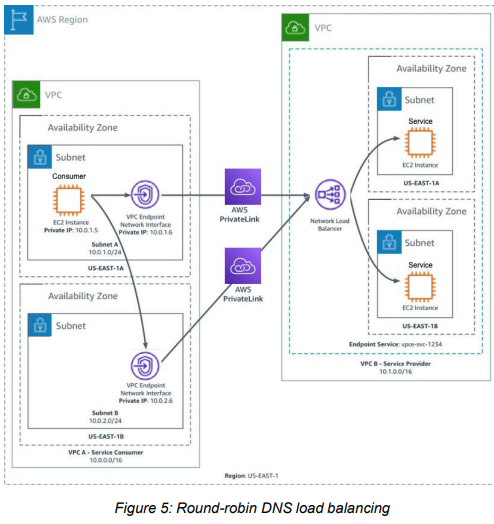
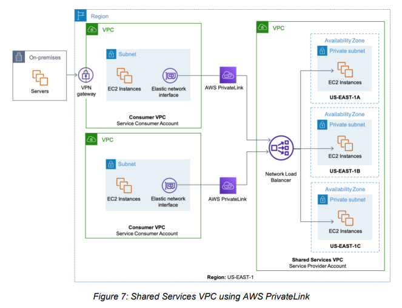
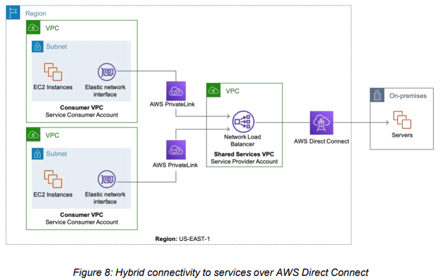
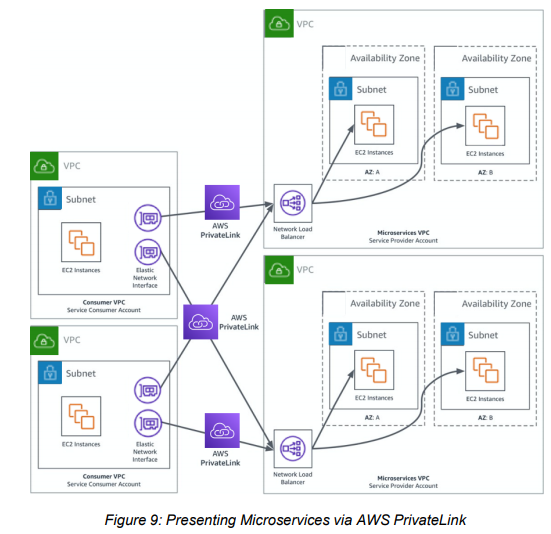
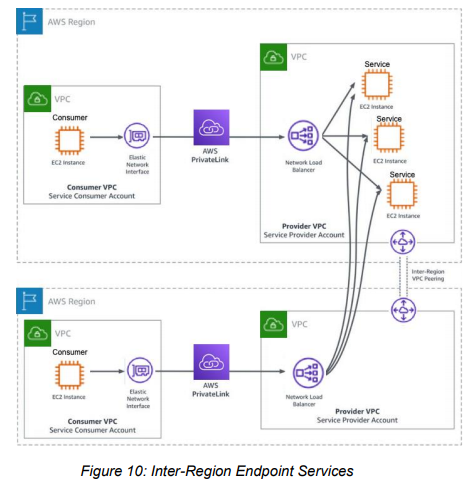
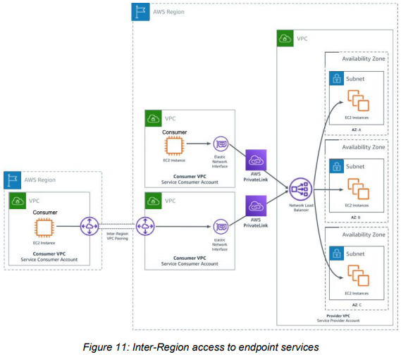

**AWS PrivateLinks** (advanced networking notes in here)

- Exposes a service VPC to tens, hundreds or thousands of customer VPCs
- Does not require VPC peering, no RT, NAT, IGWs etc.
- Requires a NLB on the service VPC and an ENI on the customer VPC
- Get static IP of the NLB and open it up to the customer VPC's ENI by creating an AWS privatelink
- Uses NLB to connect interface endpoints to services
- HLB functions at transport layer (layer 4) and can handle millions of requests per second
- https://d1.awsstatic.com/whitepapers/aws-privatelink.pdf
- Endpoint network interfaces - can be viewed in the account but customers cannot manage it themselves
- Service providers create an endpoint service using a network load balancer (which may contain multiple instances e.g. ec2). Consumers create interface endpoints, which are ENIs that connect to the Network load balancer of the provider via AWS Privatelink. The NLB allows the consumer ENI to connect to the provider's endpoint service, and therefore the instances.
- Creating HA Endpoint Services
    - **Service provider** has a VPC with a subnet, inside of which there are ec2 instances.
    - The service provider has a **service endpoint** with a NLB attached, that points to the EC2 instances inside this subnet
    - **Service consumer** is in its own VPC and own private subnet. It has an EC2 instance inside this subnet, with a private IP
    - The service consumer has a VPC endpoint network interface (also with a private IP) located inside the subnet of the consumer VPC
    - This consumer's endpoint network interface connects to the service provider's network load balancer (NLB) via AWS Privatelink
    - *Note: When an interface endpoint is crated, endpoint-specific DNS hostnames are generated that can be used to communicate with the service.*
    - After the endpoint is created, requests can be submitted to the provider's service through a few different methods
        - **Endpoint specific regional DNS Hostname**
            - Customers generate an endpoint-specific DNS hostname which includes all zonal DNS hostnames generated for the interface endpoint. The hostname includes a unique Amazon Web Services Securely Access Services Over AWS PrivateLink 11 endpoint identifier, service identifier, the region, and [vpce.amazonaws.com](http://vpce.amazonaws.com/) in its name
        - **Zonal-specific DNS Hostname**
            - Customers generate a zonal specific DNS hostname for each Availability Zone in which the endpoint is available. The hostname includes the Availability Zone in its name
        - **Private DNS Hostname**
            - If enabled, customers can use a private DNS hostname to alias the automaticallycreated zonal-specific or regional-specific DNS hostnames into a friendly hostname such as: [myservice.example.com](http://myservice.example.com/)
        - **Private IP Address of the Endpoint Network Interface **
            - The private IP address of the endpoint network interface in the VPC is directly reachable to access the service in and across Availability Zones, in the same way the zonal-specific DNS hostname is.
    - Service providers that use zonal DNS hostnames to access the service can help achieve high availability by enabling cross-zone load balancing. Cross-zone load balancing enables the load balancer to distribute traffic across the registered targets in all enabled Availability Zones.

**Deploying AWS Privatelink (Advanced details)**

- **AWS Privatelink Considerations**
    - Traffic will be sourced from the Network Load Balancer inside the service provider Amazon VPC. When service consumers send traffic to a service through an interface endpoint, the source IP addresses provided to the application are the private IP addresses of the Network Load Balancer nodes, and not the IP addresses of the service consumers
    - If you need the IP addresses of the service consumers and their corresponding interface endpoint IDs, enable Proxy Protocol on your load balancer and get the client IP addresses from the Proxy Protocol header. For more information, see [Proxy protocol](https://docs.aws.amazon.com/elasticloadbalancing/latest/network/load-balancer-target-groups.html#proxy-protocol) in the *User Guide for Network Load Balancers*.
    - Proxy protocol info
        - If you specify targets by IP address, the source IP addresses provided to your applications depend on the protocol of the target group as follows:
            - TCP and TLS: The source IP addresses are the private IP addresses of the load balancer nodes. If you need the IP addresses of the clients, enable proxy protocol and get the client IP addresses from the proxy protocol header.
            - UDP and TCP_UDP: The source IP addresses are the IP addresses of the clients.
        - If you specify targets by instance ID, the source IP addresses provided to your applications are the client IP addresses. However, if you prefer, you can enable proxy protocol and get the client IP addresses from the proxy protocol header.
    - Availability Zone names in a customer account might not map to the same locations as Availability Zone names in another account. For example, the Availability Zone US-EAST-1A might not be the same Availability Zone as USEAST-1A for another account. An endpoint service gets configured in Availability Zones according to their mapping in a customer’s account.
    - •For low latency and fault tolerance, create a Network Load Balancer with targets in each available Availability Zone of the AWS Region
- **Private Access to SaaS Applications**
    - A SaaS (or service) provider can use a Network Load Balancer to target instances in their Amazon VPC which will represent their endpoint service. Customers in AWS can then be granted access to the endpoint service and create an interface VPC endpoint in their own Amazon VPC that is associated with the endpoint service. This allows customers to access the SaaS provider’s service privately from within their own Amazon VPC.
    - Follow the best practice of creating an AWS PrivateLink endpoint in each Availability Zone within the region that the service is deployed into. This provides a highly available and low-latency experience for service consumers
- **Shared Services VPC**
    - As customers deploy their workloads on AWS, common service dependencies will often begin to emerge among the workloads. These shared services include security services, logging, monitoring, Dev Ops tools, and authentication to name a few. These common services can be abstracted into their own Amazon VPC and shared among the workloads that exist in their own separate Amazon VPCs. The Amazon VPC that contains and shares the common services is often referred to as a Shared Services VPC.
    - Traditionally, workloads inside Amazon VPCs use VPC peering to access the common services in the Shared Services VPC. Customers can implement VPC peering effectively, however, there are caveats. VPC peering allows instances from one Amazon VPC to talk to any instance in the peered VPC. Customers are responsible for implementing fine grained network access controls to ensure that only the specific resources intended to be consumed from within the Shared Services VPC are accessible from the peered VPCs. In some cases, a customer running at scale can have hundreds of Amazon VPCs, and VPC peering has a limit of 125 peering connections to a single Amazon VPC.
    - AWS PrivateLink provides a secure and scalable mechanism that allows common services in the Shared Services VPC to be exposed as an endpoint service, and consumed by workloads in separate Amazon VPCs. The actor exposing an endpoint service is called a service provider. AWS PrivateLink endpoint services are scalable and can be consumed by thousands of Amazon VPCs.
    - The service provider creates an AWS PrivateLink endpoint service using a Network Load Balancer that then only targets specific ports on specific instances in the Shared Services VPC. For high availability and low latency, we recommend using a Network Load Balancer with targets in at least two Availability Zones within a region.
    - A service consumer is the actor consuming the AWS PrivateLink endpoint service from the service provider. When a service consumer has been granted permission to consume the endpoint service, they create an interface endpoint in their VPC that connects to the endpoint service from the Shared Services VPC. As an architectural best practice to achieve low latency and high availability, we recommend creating an Interface VPC endpoint in each available Availability Zones supported by the endpoint service. Service consumer VPC instances can use a VPC’s available endpoints to access the endpoint service via one of the following ways: (1) the private endpointspecific DNS hostnames that are generated for the interface VPC endpoints or (2) the Interface VPC endpoint’s IP addresses.
    - On-premises resources can also access AWS PrivateLink endpoint services over AWS Direct Connect. Create an Amazon VPC with up to 20 interface VPC endpoints and associate with the endpoint services from the Shared Services VPC. Terminate the AWS Direct Connect connection’s private virtual interface to a virtual private gateway. Next, attach the virtual private gateway to the newly created Amazon VPC. Resources on-premises are then able to access and consume AWS PrivateLink endpoint services over the AWS Direct connection.

- **Hybrid Services**
    - As customers start their migration to the cloud, a common architecture pattern used is a hybrid cloud environment. This means that customers will begin to migrate their workloads into AWS over time, but they will also start to use native AWS services to serve their clients.
    - In a Shared Services VPC, the instances behind the endpoint service exist on the AWS cloud. AWS PrivateLink  **also**  allows you to extend resource targets for the AWS PrivateLink endpoint service to resources in an on-premises data center.
    - The Network Load Balancer for the AWS PrivateLink endpoint service can use resources in an on-premises data center as well as instances in AWS. Service consumers on AWS still access the AWS PrivateLink endpoint service by creating an interface VPC endpoint that is associated with the endpoint service in their VPC, but the requests they make over the interface VPC endpoint will be forwarded to resources in the on-premises data center.
    - The Network Load Balancer enables the extension of a service architecture to load balance workloads across resources in AWS and on-premises resources, and makes it easy to migrate-to-cloud, burst-to-cloud, or failover-to-cloud. As customers complete the migration to the cloud, on-premises targets would be replaced by target instances in AWS and the hybrid scenario would convert to a Shared Services VPC solution. See the following figure for a diagram on hybrid connectivity to services over AWS Direct Connect.

- **Microservices**
    - AWS PrivateLink is well suited for a microservices environment. Customers can give teams who own a particular service an Amazon VPC to develop and deploy their service in. Once they are ready to deploy the service for consumption by other services, they can create an endpoint service. For example, endpoint service may consist of a Network Load Balancer that can target Amazon Elastic Compute Cloud (Amazon EC2)    instances or containers on Amazon Elastic Container Service (Amazon ECS). Service teams (who own the ec2 instances, or ECS containers) can then deploy their microservices on either one of these platforms and the Network Load Balancer would provide access to the service.
    - A service  **consumer**  would then request access to the endpoint service and create an interface VPC endpoint associated with an endpoint service in their Amazon VPC. The service consumer can then begin to consume the microservice over the interface VPC endpoint.
    - Each of the consumers who have been granted access to the endpoint services would simply create interface VPC endpoints associated with the given endpoint service in their Amazon VPC for each of the microservices it wishes to consume. The service consumers will communicate with the AWS PrivateLink endpoints via endpoint-specific DNS hostnames that are generated when the endpoints are created in the Amazon VPCs of the service consumer

- **Inter-region Endpoint Services**
    - **Summary of this option: Consumer does not pay for the inter region data transfers, because the local VPC is being provided by the service provider. Consumer will still experience the latency of inter-region VPC peering. Their set up will also be easier as they just need to set up a interface endpoint to connect to the service provider's local endpoint service (NLB)**
    - Customers and SaaS providers who host their service in a single region can extend their service to additional regions through Inter-Region VPC Peering. Service providers can leverage a Network Load Balancer in a remote region and create an IP target group that uses the IPs of their instance fleet in the remote region hosting the service.
    - Inter-Region VPC Peering traffic leverages Amazon’s private fiber network to ensure that services communicate privately with the AWS PrivateLink endpoint service in the remote region. This allows the service consumer to use local interface VPC endpoints to connect to an endpoint service in an Amazon VPC in a remote region.
    - Service providers can use Inter-Region VPC Peering to provide local endpoint service access to their customers in remote regions. This approach can help the service providers gain the agility to provide the access their customers want while not having to immediately deploy their service resources in the remote regions, but instead deploying them when they are ready. If the service provider has chosen to expand their service resources into remote regions that are currently using Inter-Region VPC Peering, the service provider will have to remove the targets from the Network Load Balancer in the remote region and point them to the targets in the local region.
    - Since the remote endpoint service is communicating with resources in a remote region, additional latency will be incurred when the service consumer communicates with the endpoint service. The service provider will also have to cover the costs for the InterRegion VPC Peering data transfer. Depending on the workload, this could be a longterm approach for some service providers so long as they evaluate the pros and cons of the service consumer experience and their own operating model.

- **Inter-Region Access (by consumer) to Endpoint Services**
    - As customers expand their global footprint by deploying workloads in multiple AWS regions across the globe, they will need to ensure that the services that depend on AWS PrivateLink endpoint services have connectivity from the region they are hostedin. Customers can leverage Inter-Region VPC Peering to enable services in another region to communicate with interface VPC endpoint terminating the endpoint service which directs traffic to the AWS PrivateLink endpoint service hosted in the remote region. Inter-Region VPC Peering traffic is transported over Amazon’s network and ensures that your services communicate privately to the AWS PrivateLink endpoint service in the remote Region
    - The service consumer will first need to create an Amazon VPC in the Region where the AWS PrivateLink endpoint service is currently being hosted in. They will then need to create an InterRegion VPC Peering connection from the Amazon VPC in their region to the Amazon VPC in the remote Region. The service consumer will then need to create an interface VPC endpoint in the Amazon VPC in the remote Region that is associated with the endpoint service. The workload in the service consumers Amazon VPC can now communicate with the endpoint service in the remote Region by leveraging Inter-Region VPC Peering. The service consumer will have to consider the additional latency when communicating with endpoint service hosted in the remote Region, as well as the interregion data transfer costs between the two Regions

